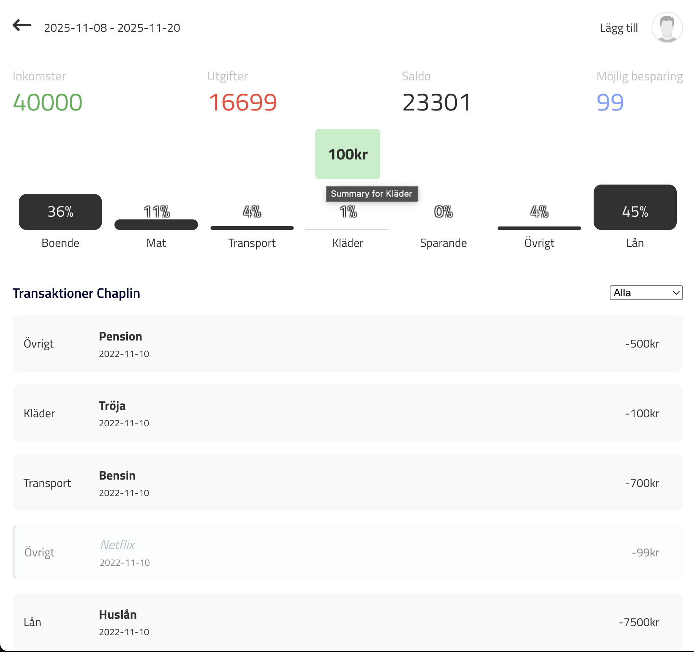

# Household Budget Tracker

A real-time personal finance management application built with React, TypeScript, and Firebase. Track income and expenses across multiple users with categorized spending analytics and visual breakdowns.



## Features

- **Real-time Data Synchronization** - Changes sync instantly across all devices using Firebase Firestore
- **Multi-user Budget Periods** - Share budget periods with household members
- **Category-based Expense Tracking** - Organize spending across 8 categories (Housing, Food, Transport, etc.)
- **Visual Analytics** - Interactive charts showing spending breakdown by category
- **Duplicate Detection** - Automatically identifies potential duplicate transactions
- **Optional Expenses** - Mark and track non-essential spending to see potential savings
- **Bulk Transaction Import** - Paste multiple transactions at once with smart formatting
- **Historical Analysis** - View average spending across budget periods
- **Responsive Design** - Works seamlessly on desktop and mobile devices

## Tech Stack

### Frontend

- **React 18** - UI framework with hooks and functional components
- **TypeScript** - Type-safe development with strict mode enabled
- **Styled Components** - Component-scoped CSS-in-JS styling
- **Recharts** - Data visualization library for expense charts
- **React Router** - Client-side routing
- **React Error Boundary** - Graceful error handling

### Backend & Infrastructure

- **Firebase Authentication** - Secure user authentication
- **Firebase Firestore** - NoSQL real-time database
- **Firebase Hosting** - Production deployment
- **Vite** - Fast build tool and dev server

### Development & CI/CD

- **Cypress** - End-to-end testing
- **GitHub Actions** - Automated CI/CD pipeline
- **ESLint** - Code quality and consistency
- **pnpm** - Fast, efficient package manager

## Getting Started

### Prerequisites

- Node.js 18+ (check `.nvmrc` for exact version)
- pnpm 8+
- Firebase account with Firestore and Authentication enabled

### Installation

1. Clone the repository

```bash
git clone https://github.com/yourusername/household-budget.git
cd household-budget
```

2. Install dependencies

```bash
pnpm install
```

3. Set up environment variables

Copy the example env file:

```bash
cp .env.example .env.development.local
```

Fill in your Firebase configuration:

```env
VITE_API_KEY=your-firebase-api-key
VITE_AUTH_DOMAIN=your-project.firebaseapp.com
VITE_PROJECT_ID=your-project-id
VITE_STORAGE_BUCKET=your-project.appspot.com
VITE_MESSAGING_SENDER_ID=your-sender-id
VITE_APP_ID=your-app-id
VITE_MEASUREMENT_ID=your-measurement-id
```

4. Start the development server

```bash
pnpm dev
```

The app will be available at `http://localhost:5173`

### Firebase Setup

1. Create a Firebase project at [console.firebase.google.com](https://console.firebase.google.com)
2. Enable **Authentication** with Email/Password provider
3. Create a **Firestore Database** in production mode
4. Set up the following Firestore collections:

   - `budgetPeriods` - Stores budget period metadata
   - `transactions` - Stores individual transactions
   - `users` - Stores user profiles and friend relationships

5. Add Firestore security rules (example):

```javascript
rules_version = '2';
service cloud.firestore {
  match /databases/{database}/documents {
    match /users/{userId} {
      allow read, write: if request.auth != null && request.auth.uid == userId;
    }
    match /budgetPeriods/{periodId} {
      allow read, write: if request.auth != null &&
        request.auth.uid in resource.data.members;
    }
    match /transactions/{transactionId} {
      allow read, write: if request.auth != null &&
        request.auth.uid == resource.data.author;
    }
  }
}
```

## Available Scripts

### Development

```bash
pnpm dev          # Start development server
pnpm build        # Build for development
pnpm build:production  # Build for production
pnpm preview      # Preview production build locally
```

### Testing

```bash
pnpm lint         # Run ESLint and check for unused exports
pnpm typecheck    # Run TypeScript compiler check
pnpm cypress      # Open Cypress test runner
pnpm cypress:run  # Run Cypress tests headlessly
```

### Deployment

```bash
pnpm deploy:dev   # Deploy to Firebase (development)
pnpm deploy:prod  # Deploy to Firebase (production)
```

## Testing

### E2E Tests with Cypress

The project uses Cypress for end-to-end testing. To run tests locally:

1. Set up test credentials in `cypress.env.json` (copy from `cypress.env.example.json`):

```json
{
  "TEST_USER_1": "your-test-email@example.com",
  "TEST_USER_2": "another-test-email@example.com",
  "TEST_PASSWORD": "your-test-password",
  "TEST_USER_1_NAME": "TestUser1",
  "TEST_USER_2_NAME": "TestUser2"
}
```

2. Create test users in Firebase Authentication with these credentials

3. Run tests:

```bash
pnpm cypress:run  # Headless mode
# or
pnpm cypress      # Interactive mode
```

## Contributing

This is a personal project, but suggestions and feedback are welcome! Feel free to open issues for bugs or feature requests.

## License

MIT License - see [LICENSE](LICENSE) file for details

## Acknowledgments

- Built as a practical solution for household budget management
- Demonstrates modern React patterns and functional programming principles
- Production-ready with CI/CD and real-world deployment

---

**Note**: This project uses Swedish language in the UI since it's designed for Swedish-speaking users. The codebase and documentation are in English for broader accessibility.
